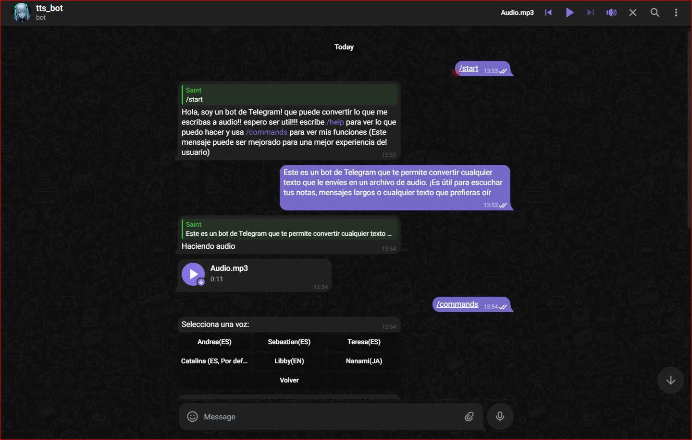

**Bot de telgram que convierte el texto que le ingreses a voz**

# Bot de Telegram para Conversión de Texto a Audio

Este es un bot de Telegram que te permite convertir cualquier texto que le envíes en un archivo de audio. ¡Es útil para escuchar tus notas, mensajes largos o cualquier texto que prefieras oír\!

## Funcionalidades

El bot ofrece las siguientes funcionalidades:

  * **`/start`**: Envía un mensaje de bienvenida al usuario y explica brevemente de qué trata el bot.
  * **`/help`**: Muestra un mensaje de ayuda detallado con todos los comandos disponibles y una explicación de cómo usar el bot.
  * **`/commands`**: Despliega un menú interactivo con botones para acceder rápidamente a las opciones principales del bot. Actualmente, permite:
      * **Voces**: Abre un submenú para seleccionar diferentes voces sintéticas para la conversión de texto a audio. El idioma de la voz está implícito en su nombre (por ejemplo, una voz que comience con `es-` será en español). La voz predeterminada es `es-CL-CatalinaNeural`.
      * **Ayuda**: Muestra el mismo mensaje de ayuda que el comando `/help`.
  * **Conversión Directa de Texto a Audio**: Simplemente escribe cualquier texto en el chat y el bot lo convertirá automáticamente en un archivo de audio MP3, utilizando la voz seleccionada (o la predeterminada si no se ha elegido otra).
  * **Limitaciones**:
      * El bot procesa un máximo de 12 párrafos por mensaje (separados por doble salto de línea). Si el mensaje excede este límite, solo se procesarán los primeros 12.
      * El texto a convertir tiene un límite de 4000 caracteres por mensaje. Si el texto es más largo, se truncará a los primeros 4000 caracteres.




<!-- ### Audios de Prueba

Aquí tienes un ejemplo del audio generado por el bot con la voz predeterminada y una alternativa:

\<audio controls\>
\<source src="assets/prueba1.mp3" type="audio/mpeg"\>
Tu navegador no soporta la reproducción de audio. \<a href="assets/prueba1.mp3"\>Descargar audio\</a\>.
\</audio\>

\<audio controls\>
\<source src="assets/preuba2.mp3" type="audio/mpeg"\>
Tu navegador no soporta la reproducción de audio. \<a href="assets/prueba2.mp3"\>Descargar audio\</a\>.
\</audio\>
 -->


## Notas Adicionales

  * El bot utiliza la librería `edge-tts` para la síntesis de voz.
  * Si experimentas algún problema o tienes sugerencias, no dudes en contactarme.

-----

**Como correr localmente este proyecto:**

1.  **Clona el Repositorio:**

2.  **Configura el Entorno Virtual (Recomendado):**
    ```bash
    python -m venv venv
    .\venv\Scripts\activate   # En Windows
    source venv/bin/activate # En macOS/Linux
    ```
3.  **Instala las Dependencias:**
    ```bash
    pip install -r requirements.txt # Asegúrate de tener un archivo requirements.txt con tus dependencias
    ```

4.  **Configura tu Token de Telegram:**
    Crea o usa el archivo  `.env` en la raíz del proyecto y añade tu token de bot de Telegram:
    ```
    TOKEN="TU_TOKEN_AQUÍ"
    ```
    (Obtén tu token de BotFather en Telegram si aún no lo tienes).

5.  **Ejecuta el Bot:**
    ```bash
    python app/app.py
    ```